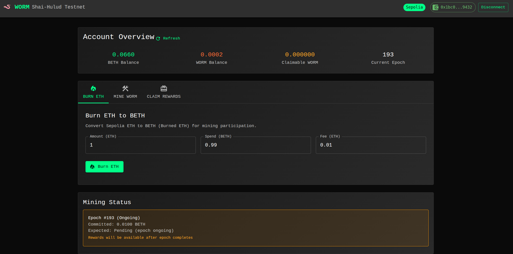

# WORM Shai-Hulud Testnet - Complete Testing Environment

## 🎯 Overview
This repository contains a complete testing environment for the WORM Shai-Hulud incentivized testnet, including:
- **Official WORM miner** (via git submodule for security)
- **Web-based React UI** with MetaMask integration
- **Backend API server** for WORM operations
- **Docker containerization** for easy deployment
- **Automated shell scripts** for all operations

## 🖼️ UI Preview



*The React-based web interface provides an intuitive way to interact with the WORM testnet, featuring MetaMask integration, real-time balance updates, and comprehensive mining operations.*

## 🔒 Security & Trust

### **Official Code Only**
- ✅ **Git Submodule**: Uses official WORM miner repository (no copied code)
- ✅ **Verifiable**: Users can verify the miner code authenticity
- ✅ **Secure**: No risk of malicious modifications to core miner code
- ✅ **Updated**: Automatically tracks official repository updates

### **Why This Matters**
This project follows security best practices by using git submodules instead of copying code, ensuring users can trust they're running the authentic WORM miner without any modifications.

## 📁 Project Structure

```
worm-testing/
├── miner/                    # Official WORM miner (git submodule)
├── scripts/                  # Shell script wrappers
├── ui/
│   ├── backend/             # Node.js Express API server
│   └── frontend/            # React TypeScript UI
├── docker-compose.yml       # Docker orchestration
├── Dockerfile.miner         # WORM miner container
├── docs/                    # Documentation
├── logs/                    # Operation logs
├── .env.example            # Environment template
└── README.md               # This file
```

## 🚀 Quick Start

### Prerequisites
- **Machine**: x86-64 architecture (VPS, dedicated server, or local machine)
- **RAM**: Minimum 16GB
- **OS**: Debian/Ubuntu recommended
- **Docker & Docker Compose**: For containerized setup (recommended)
- **MetaMask**: Browser extension for UI testing
- **Sepolia ETH**: 1.0+ testnet ETH from faucets

## 🐳 Docker Setup (Recommended)

### **One-Command Setup**
```bash
# Clone with submodules
git clone --recursive https://github.com/2Rebfl/worm-testing.git
cd worm-testing

# Configure environment
cp .env.example .env
# Edit .env with your private key

# Start everything with Docker
docker-compose up -d

# Download WORM parameters (one-time setup)
docker exec worm-miner worm-miner-download-artifacts

# Access the UI
open http://localhost:3000
```

### **Docker Benefits**
- ✅ **No local dependencies** (Rust, Node.js, etc.)
- ✅ **Consistent environment** across all machines
- ✅ **Easy deployment** with single command
- ✅ **Automatic networking** between services
- ✅ **Volume persistence** for WORM data

### **Docker Commands**
```bash
# Start all services
docker-compose up -d

# View logs
docker-compose logs -f

# Stop all services
docker-compose down

# Rebuild after changes
docker-compose build

# Execute worm-miner commands
docker exec worm-miner worm-miner info --network sepolia --private-key YOUR_KEY
```

## 🔧 Manual Setup (Alternative)

### 1. Environment Setup

```bash
# Install system dependencies
sudo apt update
sudo apt install -y build-essential cmake libgmp-dev libsodium-dev nasm curl m4 git wget unzip nlohmann-json3-dev

# Install Rust
curl --proto '=https' --tlsv1.2 -sSf https://sh.rustup.rs | sh
source $HOME/.cargo/env

# Install Node.js (if not already installed)
curl -fsSL https://deb.nodesource.com/setup_18.x | sudo -E bash -
sudo apt-get install -y nodejs
```

### 2. Initialize Submodules

```bash
# Initialize and update git submodules
git submodule update --init --recursive
```

### 3. Build WORM Miner

```bash
cd miner
make download_params  # Downloads 5GB+ parameter files
cargo install --path .
cd ..
```

### 4. Configure Environment

```bash
# Copy and edit environment file
cp .env.example .env
# Edit .env with your private key and settings
```

### 5. Install UI Dependencies

```bash
# Backend dependencies
cd ui/backend
npm install
cd ../frontend

# Frontend dependencies  
npm install --legacy-peer-deps
cd ../..
```

## 🖥️ Usage Options

### Option A: Command Line Interface

#### Basic Operations
```bash
# Check account info
./scripts/info.sh

# Burn ETH to BETH
./scripts/burn.sh 1 0.999 0.001

# Participate in mining
./scripts/participate.sh 0.1 3

# Claim rewards
./scripts/claim.sh 0 1
```

### Option B: Web UI Interface

#### Start Servers
```bash
# Terminal 1: Start backend API server
cd ui/backend
npm start
# Server runs on http://localhost:3001

# Terminal 2: Start frontend development server
cd ui/frontend  
npm start
# UI available at http://localhost:3000
```

#### Using the Web UI
1. **Open Browser**: Navigate to `http://localhost:3000`
2. **Connect Wallet**: Click "Connect Wallet" and connect MetaMask to Sepolia
3. **View Account**: See BETH/WORM balances and current epoch
4. **Burn ETH**: Convert Sepolia ETH to BETH for mining
5. **Mine WORM**: Participate in mining epochs
6. **Claim Rewards**: Claim earned WORM tokens

## 🔧 API Endpoints

The backend server provides REST API endpoints:

### Account Operations
- `GET /api/account/info` - Get account information
- `GET /api/account/coins` - List unspent coins

### WORM Operations  
- `POST /api/worm/burn` - Burn ETH to BETH
- `POST /api/worm/participate` - Participate in mining
- `POST /api/worm/claim` - Claim WORM rewards
- `POST /api/worm/spend` - Spend from coins
- `POST /api/worm/recover` - Recover failed burns

### Health Check
- `GET /api/health` - Server health status

## 🎨 UI Features

### Dashboard Components
- **Account Overview**: Real-time balance display
- **Burn ETH Tab**: Convert ETH to BETH with form validation
- **Mine WORM Tab**: Participate in mining epochs
- **Claim Rewards Tab**: Claim earned tokens
- **Mining Status**: View active epoch participation

### Technical Features
- **MetaMask Integration**: Seamless wallet connection
- **Sepolia Network**: Automatic network switching
- **Real-time Updates**: 30-second data refresh
- **Error Handling**: Comprehensive error states
- **Responsive Design**: Mobile-friendly interface
- **TypeScript**: Full type safety
- **Material-UI**: Professional component library

## 📊 Mining Process

### Understanding Epochs
- **Duration**: 30 minutes each
- **Rewards**: 50 WORM per epoch (fixed pool)
- **Distribution**: Proportional to BETH committed
- **Participation**: Commit BETH for multiple epochs

### Example Reward Calculation
```
Total Epoch Pool: 50 WORM
Your BETH: 1.0
Total BETH: 5.0
Your Reward: (1.0/5.0) × 50 = 10 WORM
```

## 🔐 Security Notes

### Environment Variables
```bash
# .env file contains sensitive data
PRIVATE_KEY=your_sepolia_private_key_here
NETWORK=sepolia
```

### Best Practices
- **Never share private keys**
- **Use dedicated testnet wallet**
- **Store burn keys securely**
- **Monitor transaction logs**

## 🛠️ Development

### Backend Development
```bash
cd ui/backend
npm run dev  # Development mode with auto-reload
```

### Frontend Development
```bash
cd ui/frontend
npm start    # Development server with hot reload
npm run build # Production build
npm test     # Run test suite
```

### Adding New Features
1. **Backend**: Add routes in `ui/backend/server.js`
2. **Frontend**: Create components in `ui/frontend/src/components/`
3. **Scripts**: Add shell wrappers in `scripts/`

## 📝 Logging

All operations are logged to the `logs/` directory:
- `worm-operations.log` - All WORM operations
- `api-requests.log` - Backend API requests
- `errors.log` - Error tracking

## 🐛 Troubleshooting

### Common Issues

#### Build Failures
```bash
# OpenSSL issues
sudo apt install libssl-dev pkg-config

# Parameter download fails
cd miner && make download_params
```

#### UI Issues
```bash
# Dependency conflicts
npm install --legacy-peer-deps

# TypeScript errors
npm run build
```

#### MetaMask Issues
- Ensure MetaMask is installed
- Switch to Sepolia testnet
- Check account has Sepolia ETH

### Getting Help
- Check logs in `logs/` directory
- Review console output for errors
- Verify environment configuration

## 🎁 Testnet Rewards

### Maximizing Rewards
1. **Consistent Participation**: Mine regularly across epochs
2. **Test All Features**: Use both CLI and UI interfaces
3. **Report Issues**: Document bugs and improvements
4. **Community Engagement**: Join Discord/Telegram

### Success Metrics
- [x] Environment setup complete
- [x] Successful ETH burns
- [x] Mining participation
- [x] WORM rewards claimed
- [x] UI functionality tested
- [x] All features working

## 📚 Resources

- **WORM GitHub**: https://github.com/worm-privacy/shaihulud
- **Sepolia Faucets**: 
  - https://sepoliafaucet.com
  - https://faucet.sepolia.dev
- **Sepolia Explorer**: https://sepolia.etherscan.io

## 🔄 Recent Updates

### v2.0 - Security & Docker Improvements
- **Security**: Replaced copied code with official git submodule
- **Docker**: Complete containerization with Docker Compose
- **Trust**: Users can verify authentic WORM miner code
- **Deployment**: One-command setup with Docker
- **Maintenance**: Automatic updates from official repository

### v1.1 - Mining Functionality Improvements
- **Fixed**: "Cannot claim an ongoing epoch!" error resolved
- **Enhanced**: Proper handling of ongoing vs completed epochs
- **Improved**: Better error handling for contract business rules
- **Added**: Visual indicators for epoch status in UI
- **Updated**: Contract service with correct ABI definitions

## 🏆 Completion Status

✅ **Complete WORM Testing Environment Ready**

This setup provides everything needed to participate in the WORM Shai-Hulud testnet with both command-line and web interfaces. The React UI offers a user-friendly way to perform all WORM operations while the CLI provides direct access for advanced users.

**Latest Version**: Secure, containerized setup with official WORM miner code and comprehensive Docker support.

---

**Happy Testing!** 🐛⛏️
